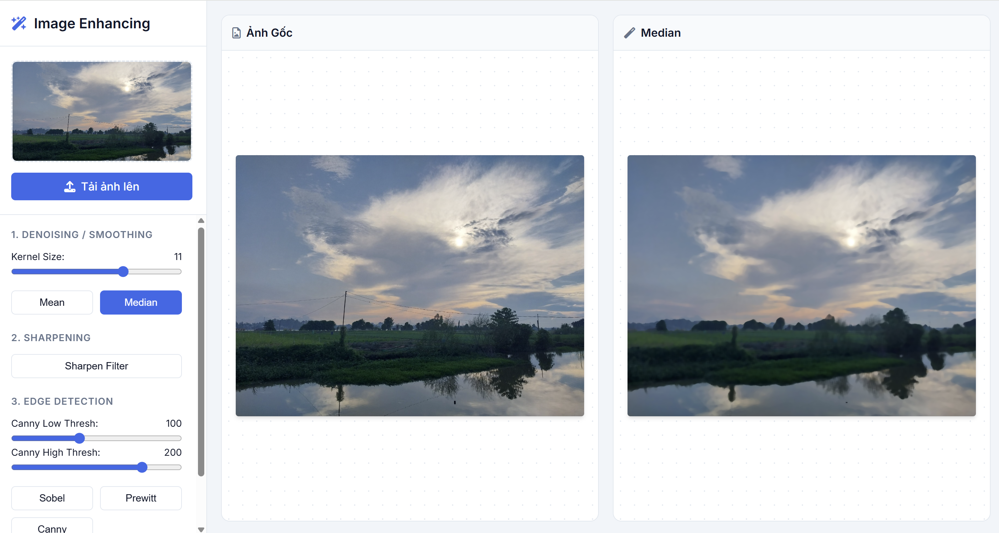

# ✨ Image Enhancing Web App

Một ứng dụng web được xây dựng bằng FastAPI và OpenCV cho phép nâng cao chất lượng ảnh theo thời gian thực. Dự án này cung cấp một giao diện tương tác để người dùng có thể tải ảnh lên và áp dụng các bộ lọc không gian khác nhau, bao gồm khử nhiễu, làm nét và dò biên.

<p align="center">
  
  
  
</p>

<br>

<p align="center">
  
</p>

Trải nghiệm ngay: https://imageenhancingapp.onrender.com/

## 🌟 Tính năng 

-   🌬️ **Khử nhiễu & Làm mịn**:
    -   **Mean Filter**: Làm mờ ảnh để giảm nhiễu.
    -   **Median Filter**: Hiệu quả trong việc loại bỏ nhiễu "muối tiêu".
-   🔍 **Làm nét**:
    -   Sử dụng kernel làm nét để tăng cường các chi tiết và cạnh.
-   🕸️ **Dò biên**:
    -   **Sobel & Prewitt**: Các toán tử dựa trên gradient để phát hiện cạnh.
    -   **Canny Edge Detector**: Thuật toán dò biên đa tầng cho kết quả rõ nét với ngưỡng có thể tùy chỉnh.
-   🎛️ **Điều khiển tương tác**: Người dùng có thể điều chỉnh các tham số của bộ lọc như kích thước kernel và ngưỡng Canny theo thời gian thực.

## 🛠️ Công nghệ sử dụng

-   **Backend**: Python, FastAPI, OpenCV, Uvicorn, Gunicorn
-   **Frontend**: HTML5, CSS3, JavaScript (ES6+)

## 🚀 Hướng dẫn cài đặt và chạy

Làm theo các bước sau để chạy dự án trên máy tính của bạn.

### ✅ Yêu cầu
-   Python 3.12+
-   `pip` 

### ⚙️ Cài đặt
1.  **Clone repository về máy:**
    ```bash
    git clone https://github.com/haohienhoa/ImageEnhancingApp.git
    cd ImageEnhancingApp
    ```

2.  **Tạo và kích hoạt môi trường ảo:**
    ```bash
    # Tạo môi trường ảo
    python -m venv venv

    # Kích hoạt trên Windows
    .\venv\Scripts\activate

    # Kích hoạt trên macOS/Linux
    source venv/bin/activate
    ```

3.  **Cài đặt các thư viện cần thiết:**
    ```bash
    pip install -r requirements.txt
    ```

### ▶️ Khởi chạy
Chạy server phát triển bằng Uvicorn:
```bash
uvicorn main:app --reload
```
Ứng dụng sẽ có sẵn tại địa chỉ `http://127.0.0.1:8000`.
